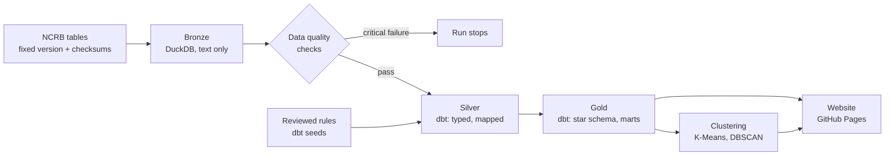

# Crime in India: Data Platform

[](https://github.com/Lisasilva/Crimes-in-India-data-platform/actions/workflows/pipeline.yml)

**Live site:** https://lisasilva.github.io/Crimes-in-India-data-platform/

This is an end-to-end, reproducible data pipeline for official NCRB crime statistics covering every
Indian state and union territory from 2001 to 2024. It downloads and verifies the raw tables, runs
data quality checks, models the data in dbt on DuckDB, groups states by clustering, and publishes a
website with two views: **all crimes** under the Indian Penal Code (and, from July 2024, the
Bharatiya Nyaya Sanhita), and **crimes against women**. The whole pipeline runs in GitHub Actions on
every change and once a month, using only free, open-source tools.

It grew out of my university Data Mining project, which applied K-Means and DBSCAN to crimes against
women for 2001–2010 ([original repository](https://github.com/Lisasilva/Crime-Analysis-in-India),
[notebook](notebooks/original_analysis.ipynb), [report](docs/Final_Report_Crime_Analysis.pdf)).
This version adds the engineering around that analysis: automated ingestion, data quality checks,
layered modelling, tests, CI/CD and documentation. It also extends the data to 2024 and to all
crimes, and replaces a community copy of the data with NCRB's own published tables.

## Architecture



| Layer | Tool | What it does |
| --- | --- | --- |
| Ingestion | Python, DuckDB | Downloads NCRB tables from one fixed commit (`pipeline/fetch.py`), verifies each file against its sha256 in `data/raw/manifest.yml`, and loads every cell as text so nothing is coerced or lost. |
| Data quality | Python, SQL | 75 checks: schema drift, unrecognised state names, invalid numbers, missing years, totals that do not add up to NCRB's all-India row, copied years and sudden jumps. Critical checks stop the run. |
| Modelling | dbt-core, dbt-duckdb | Staging views, a silver layer that maps NCRB's changing column names onto stable crime groups using reviewed seed files, and a gold star schema with rates per 100,000 people or women. Backed by 118 dbt tests, including tests that reproduce NCRB's own published totals and rates. |
| Analysis | scikit-learn | For each view, K-Means picks the number of groups by silhouette score and DBSCAN flags states unlike any other. |
| Presentation | Plotly, GitHub Pages | A static site rebuilt from the gold tables on every run, with an All crimes / Crimes against women switch and CSV downloads. |
| Orchestration | GitHub Actions | Runs tests, then the pipeline, then deploys the site, on every push and pull request and monthly. |

## Data quality

Each problem in the sources is handled by a rule in the repository rather than a manual edit. The
main ones:

- **NCRB renamed and regrouped its crime heads** in 2014, 2017 and 2024 (when the Bharatiya Nyaya
  Sanhita replaced the IPC). A reviewed mapping (`dbt/seeds/crime_head_columns.csv`) assigns every
  column in every year to one stable crime group, and a check stops the run if a mapped column
  disappears.
- **Every total is checked against NCRB's own.** State figures must add up to the all-India row
  printed in each table, total IPC cases must match NCRB's summary table, and the rates computed here
  must reproduce NCRB's printed rates.
- **Two NCRB tables agree.** The crimes-against-women tables and the all-crimes tables report 4,927 of
  the same figures, and all of them match.
- **The Kaggle copy is a backup only.** It was the original source of this project. Compared with
  NCRB's tables, 4,509 of its figures match and 392 differ, including shifted state labels in 2020
  and 2021, so it is kept only as a cross-check.

The full list, with evidence for each problem, is in [docs/data_quality.md](docs/data_quality.md).

## Data model

| Table | Grain | Purpose |
| --- | --- | --- |
| `gold.fct_crimes` | state × year × crime group | IPC/BNS cases, NCRB population and rate per 100,000 people |
| `gold.fct_crimes_against_women` | state × year × crime type | Cases, female population and rate per 100,000 women |
| `gold.dim_state` | state or union territory | Analysis units, including merged areas (Ladakh with J&K, Dadra & Nagar Haveli with Daman & Diu) and years covered |
| `gold.dim_crime_group`, `gold.dim_crime_type` | crime group or type | Names, legal sections and notes on definition changes |
| `gold.dim_population` | state × year | The mid-year population NCRB used for its rates, and the female population |
| `gold.mart_state_all_crime_profile` | state | Average rates for 11 crime groups, 2017–2021: input to the all-crimes clustering |
| `gold.mart_state_crime_profile` | state | Average rates for 6 crimes against women, 2017–2021: input to the women clustering |
| `gold.mart_national_crime_trend`, `gold.mart_national_trend` | year × crime | All-India cases and rates for each view |
| `gold.mart_crime_source_overlap` | state × year × crime | The same figure from two sources side by side |
| `gold.state_clusters`, `gold.cluster_scores` | view × state | Cluster, unusual-state flag, map position and silhouette scores |

## Findings

- **All crimes.** Rates per 100,000 people rose sharply after 2013 in several states, Delhi most of
  all, where the rate is now around five times the all-India level, mostly because of theft. Part of
  that rise is likely better recording, not only more crime.
- **Crimes against women.** Rates have risen for most crime types since 2001. Some of that rise
  reflects better reporting and the wider legal definitions introduced in 2013.
- **Clustering.** In both views the states split best into two groups, higher and lower rates. For
  crimes against women the silhouette score is 0.31, so the groups are real but overlap. For all
  crimes it is 0.18, which is weak: the states sit on a spectrum rather than forming clear types.
  (The original notebook reported 0.74, but that was measured on synthetic practice data.)
- **Unusual states.** DBSCAN flags Delhi, Mizoram and Lakshadweep in the all-crimes view, and Bihar
  and Lakshadweep in the women view, where dowry deaths in Bihar are over four times the typical
  state's rate.

## Running it

The pipeline needs Python 3.11 and a few minutes. It runs entirely in GitHub Actions, or in a GitHub
Codespace without installing anything locally.

```bash
pip install -r requirements.txt
pytest -q                  # unit, dbt and end-to-end tests
python -m pipeline.run     # fetch → bronze → checks → dbt → clustering; writes warehouse/ and reports/
python -m pipeline.site    # builds site/index.html from the gold tables
```

To explore the warehouse afterwards, open `warehouse/crime.duckdb` with the DuckDB CLI or Python, or
run dbt directly from `dbt/` with `dbt build --profiles-dir .`.

## Repository layout

```
data/raw/          raw files and the checksum manifest (NCRB tables are downloaded on demand)
pipeline/          download, ingestion, quality checks, clustering, site builder, entry point
dbt/               models (staging, intermediate, marts), seeds, tests
tests/             pytest suite
docs/              data quality write-up, original report
notebooks/         original university analysis
.github/workflows/ CI/CD: test, build, deploy
```

## Data sources

Primary, all published by the National Crime Records Bureau (NCRB):

- *Crime in India* 2014–2024 tables 1.4, 1.6, 1A.1, 1A.4, 3A.1, 3A.2 and 5.1, as extracted from the
  NCRB PDFs by the [reclaimchennai/NCRB](https://github.com/reclaimchennai/NCRB) project, pinned to
  one commit; plus, from the same project, NCRB's 2001–2015 crimes-against-women series and the
  2001–2013 summary tables.
- *District-wise crimes under various sections of IPC*, 2001–2014, on
  [data.gov.in](https://www.data.gov.in/catalog/district-wise-crimes-under-various-sections-indian-penal-code-ipc-crimes)
  (Government Open Data License – India).
- Population: NCRB's mid-year projections from the same tables; Census of India 2011 for each state's
  female share before 2012.

Secondary, used only as a cross-check:

- *Crimes against women in India, 2001–2021*, Kaggle (balajivaraprasad). Apache-2.0.
- *Crime in India*, Kaggle (rajanand): NCRB cases under crimes against women, 2001–2010, the file used
  in the original notebook.

## Limitations

- Recorded cases depend on how often crimes are reported to the police, and that differs between
  states and over time.
- Crime groups are mapped across law changes, but some are not fully comparable: hurt has no 2024
  figure because the BNS grievous hurt group also counts some simple hurt.
- NCRB did not publish a female population before 2012, so women's rates for 2001–2011 use an
  estimate (NCRB's total population times the state's female share in the 2011 census).

## Background

Crime is a behavioural disorderliness which is a result of societal, economical, and environmental
factors. There is an increase in violence against women each day, and it can take several forms:
rape, sexual harassment, dowry, abduction and others are some of the most committed crimes against
women, and they result in life-long trauma or deaths. Safety and security of all is an absolute
right. To control the rising crime rate, it is necessary to extract and analyse all relevant data on
a regular basis and take the necessary steps to ensure the safety of all.
