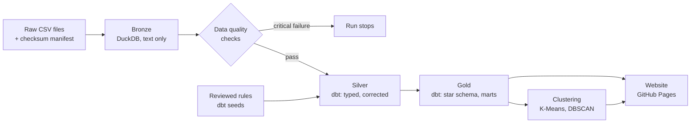

# Crimes Against Women in India: Data Platform

[](https://github.com/Lisasilva/Crimes-in-India-data-platform/actions/workflows/pipeline.yml)

**Live site:** https://lisasilva.github.io/Crimes-in-India-data-platform/

This is an end-to-end, reproducible data pipeline for NCRB crime statistics covering every Indian state
and union territory from 2001 to 2021. It ingests the raw files, runs data quality checks, models
the data in dbt on DuckDB, groups states by clustering, and publishes a website. The whole pipeline
runs in GitHub Actions on every change and once a month, using only free, open-source tools.

It grew out of my university Data Mining project, which applied K-Means and DBSCAN to crime data
for 2001–2010 ([original repository](https://github.com/Lisasilva/Crime-Analysis-in-India),
[notebook](notebooks/original_analysis.ipynb), [report](docs/Final_Report_Crime_Analysis.pdf)).
This version adds the engineering around that analysis: automated ingestion, data quality
checks, layered modelling, tests, CI/CD and documentation. It also extends the data to 2021.

## Architecture



| Layer | Tool | What it does |
| --- | --- | --- |
| Ingestion | Python, DuckDB | Verifies each file against its sha256 in `data/raw/manifest.yml` and loads it as text, so nothing is coerced or lost. Rows broken by unquoted commas are repaired by rule; rows that cannot be repaired are kept in `bronze.rejected_rows`. |
| Data quality | Python, SQL | 15 checks per source: schema drift, duplicate keys, invalid numbers, missing years, totals that do not add up, copied years and sudden jumps. Critical checks stop the run. |
| Modelling | dbt-core, dbt-duckdb | Staging views, a silver layer that applies reviewed corrections, and a gold star schema with rates per 100,000 women. Backed by 55 dbt tests. |
| Analysis | scikit-learn | K-Means picks the number of groups by silhouette score; DBSCAN flags states unlike any other. |
| Presentation | Plotly, GitHub Pages | A static site rebuilt from the gold tables on every run, with CSV downloads. |
| Orchestration | GitHub Actions | Runs tests, then the pipeline, then deploys the site, on every push and pull request and monthly. |

## Data quality

The sources had real problems, and each one is now handled by a rule in the repository rather than a
manual edit. The main ones:

- **2020–2021 rows had shifted state labels.** NCRB changed its state order in 2020, and the
  labels in the file were not updated, so from Jammu & Kashmir onward each row held another state's
  figures. A reviewed mapping (`dbt/seeds/kaggle_relabel_2020_2021.csv`) corrects them. A dbt test
  fails for 11 states if the correction is removed.
- **Copied and empty years** (West Bengal 2019, Jharkhand 2004, assault on women in 2011) are set to
  missing with the reason recorded, never guessed.
- **Delhi 2001–2010** was missing and is filled from a second NCRB file. The two files agree on all
  2,380 figures they share, and this is re-checked on every run.

The full list, with evidence for each problem, is in [docs/data_quality.md](docs/data_quality.md).

## Data model

| Table | Grain | Purpose |
| --- | --- | --- |
| `gold.fct_crimes_against_women` | state × year × crime type | Cases, rate per 100,000 women, source, and any data issue |
| `gold.dim_state` | state or union territory | Analysis units, including merged areas (Ladakh with J&K, Dadra & Nagar Haveli with Daman & Diu) |
| `gold.dim_crime_type` | crime type | Names, legal sections and source column names |
| `gold.mart_state_crime_profile` | state | Average rates for 2017–2021, the input to clustering |
| `gold.mart_national_trend` | year × crime type | All-India cases and rates |
| `gold.mart_source_comparison` | state × year × crime type | Kaggle and NCRB figures side by side |
| `gold.state_clusters` | state | Cluster, unusual-state flag and map position |

## Findings

- Cases per 100,000 women have risen for most crime types since 2001. Some of that rise reflects
  better reporting and the wider legal definitions introduced in 2013, not only more crime.
- States split best into two groups, higher and lower crime rates. The silhouette score is 0.31,
  which means the groups are real but overlap. (The original notebook reported 0.74, but that was
  measured on synthetic practice data.)
- DBSCAN flags Bihar, where dowry deaths are over four times the typical state's rate while
  harassment offences are almost zero, and Lakshadweep, where a handful of cases is enough to move
  the rates.

## Running it

The pipeline needs Python 3.11 and about a minute. It runs entirely in GitHub Actions, or in a
GitHub Codespace without installing anything locally.

```bash
pip install -r requirements.txt
pytest -q                  # unit, dbt and end-to-end tests
python -m pipeline.run     # bronze → checks → dbt → clustering; writes warehouse/ and reports/
python -m pipeline.site    # builds site/index.html from the gold tables
```

To explore the warehouse afterwards, open `warehouse/crime.duckdb` with the DuckDB CLI or Python, or run dbt directly from
`dbt/` with `dbt build --profiles-dir .`.

## Repository layout

```
data/raw/          raw files and their checksum manifest
pipeline/          ingestion, quality checks, clustering, site builder, entry point
dbt/               models (staging, intermediate, marts), seeds, tests
tests/             pytest suite
docs/              data quality write-up, original report
notebooks/         original university analysis
.github/workflows/ CI/CD: test, build, deploy
```

## Data sources

- *Crimes against women in India, 2001–2021*, Kaggle (balajivaraprasad), compiled from NCRB
  releases on data.gov.in. Apache-2.0.
- *Crime in India*, Kaggle (rajanand): NCRB cases under crimes against women, 2001–2010.
- Census of India 2011: female population by state, used for rates.

## Limitations

- Rates use the 2011 census because it is the latest one. Populations have grown since then, so
  rates for later years are somewhat overstated, more so in faster-growing states.
- Recorded cases depend on how often crimes are reported to the police, and that differs between
  states.
- Data after 2021 is published only as PDF tables and is not included yet.

## Background

Crime is a behavioural disorderliness which is a result of societal, economical, and environmental
factors. There is an increase in violence against women each day, and it can take several forms:
rape, sexual harassment, dowry, abduction and others are some of the most committed crimes against
women, and they result in life-long trauma or deaths. Safety and security of all is an absolute
right. To control the rising crime rate, it is necessary to extract and analyse all relevant data on
a regular basis and take the necessary steps to ensure the safety of all.
